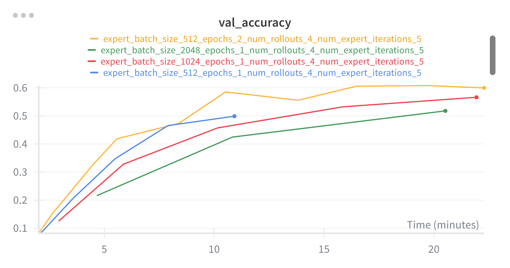

# Problem (expert_iteration_experiment): Run expert iteration on the MATH dataset (2
points) (6 H100 hrs)


Run expert iteration on the MATH dataset (provided at /data/a5-alignment/MATH/train.jsonl)
15
using the Qwen 2.5 Math 1.5B Base model, varying the number of rollouts G per question and the
number of epochs used in the SFT step, and using n_ei_steps = 5. Vary the batch size for each
expert iteration step (i.e., the size of Db) in {512, 1024, 2048}. (You do not need to try all possible
combinations of these hyperparameters. Just enough to draw conclusions about each is fine.) Log the
entropy of the model’s reponses over training. Make sure to have vLLM terminate generations at the
second answer tag </answer>, as done in the SFT section.

**Deliverable** Validation accuracy curves associated with different rollout configurations. Try at
least 2 different rollout counts and epoch counts.
**Deliverable** A model that achieves validation accuracy of at least 15% on MATH.
**Deliverable** A brief 2 sentence discussion comparing to your SFT performance, as well as perfor-
mance across EI steps.
**Deliverable** A plot of the entropy of the model’s responses over training.
**Deliverable** A plot of the entropy of the model’s responses over training.

---- 
Running the code 
```bash
uv run expert_iteration.py
# or 
bash expert_iteration.sh
```


Ran out of compute and energy, but lessons learned: 
1. Need a smaller stepsize to avoid over fitting to any one batch. Catastrophic forgetting is real.
2. Logging the entropy of model responses was slowing the code down because I didn't realize that VLLM could return log probs. Instead, I was passing the responses through the model. In any case, using the VLLM solution would speed stuff up.
3. When doing multiple epochs per expert iteration step, you should probably decrease the stepsize over time. 
