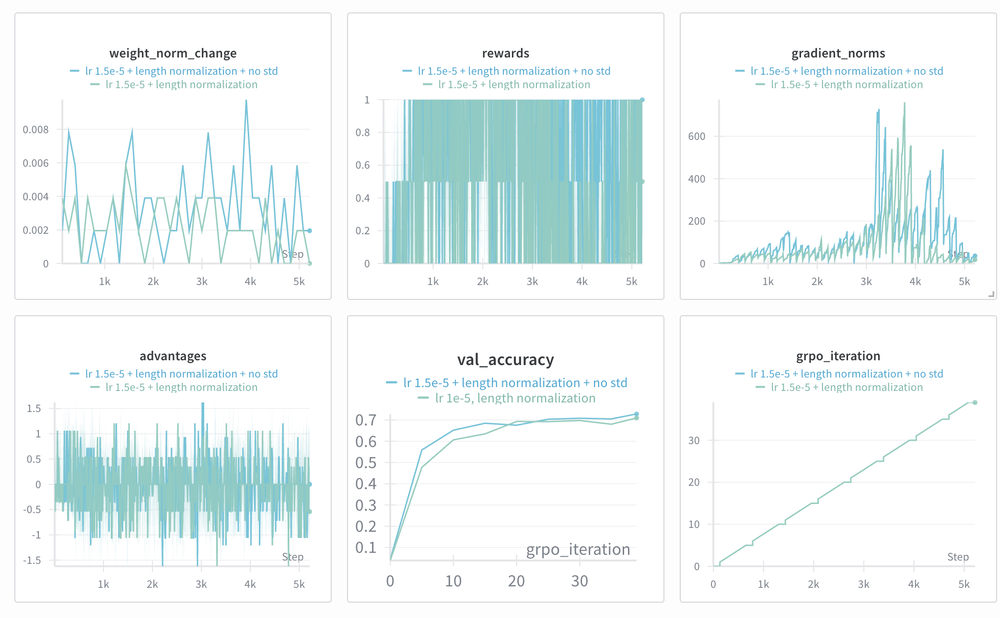
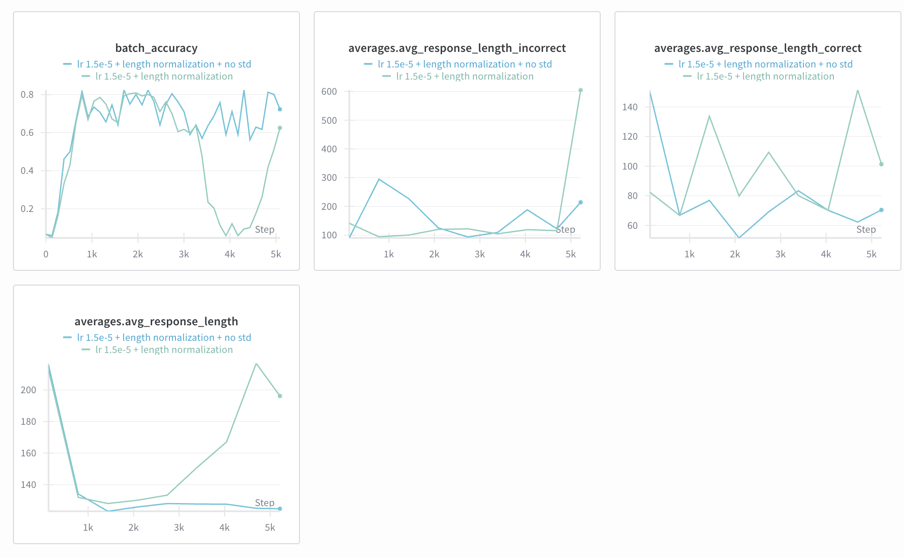

# Problem (grpo_group_standard_deviation): Effect of standard deviation normalization (2
points) (2 H100 hrs)

Deliverable: Compare the performance of use_std_normalization == True and use_std_ ⌋
normalization == False. Report the validation answer reward curves. Comment on the findings,
including any other metrics that have a noticeable trend.
Hint: consider metrics related to stability, such as the gradient norm.

