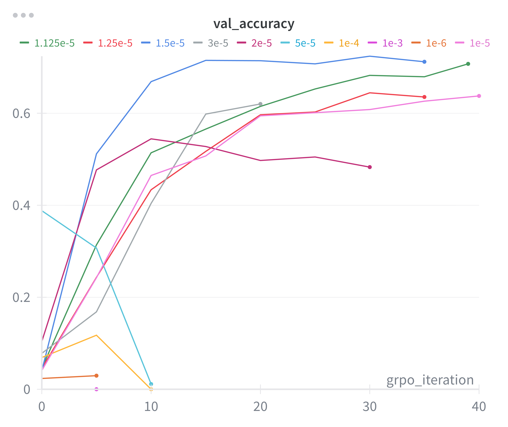

# Problem (grpo_learning_rate): Tune the learning rate (2 points) (6 H100 hrs)
Starting with the suggested hyperparameters above, perform a sweep over the learning rates and
report the final validation answer rewards (or note divergence if the optimizer diverges).
Deliverable: Validation reward curves associated with multiple learning rates.
Deliverable: A model that achieves validation accuracy of at least 25% on MATH.
Deliverable: A brief 2 sentence discussion on any other trends you notice on other logged metrics.

```bash
uv run grpo_learning_rate.sh --lr 1.5e-5
```



Read about my reasoning on twitter [here](https://x.com/damekdavis/status/1967007561007210699)