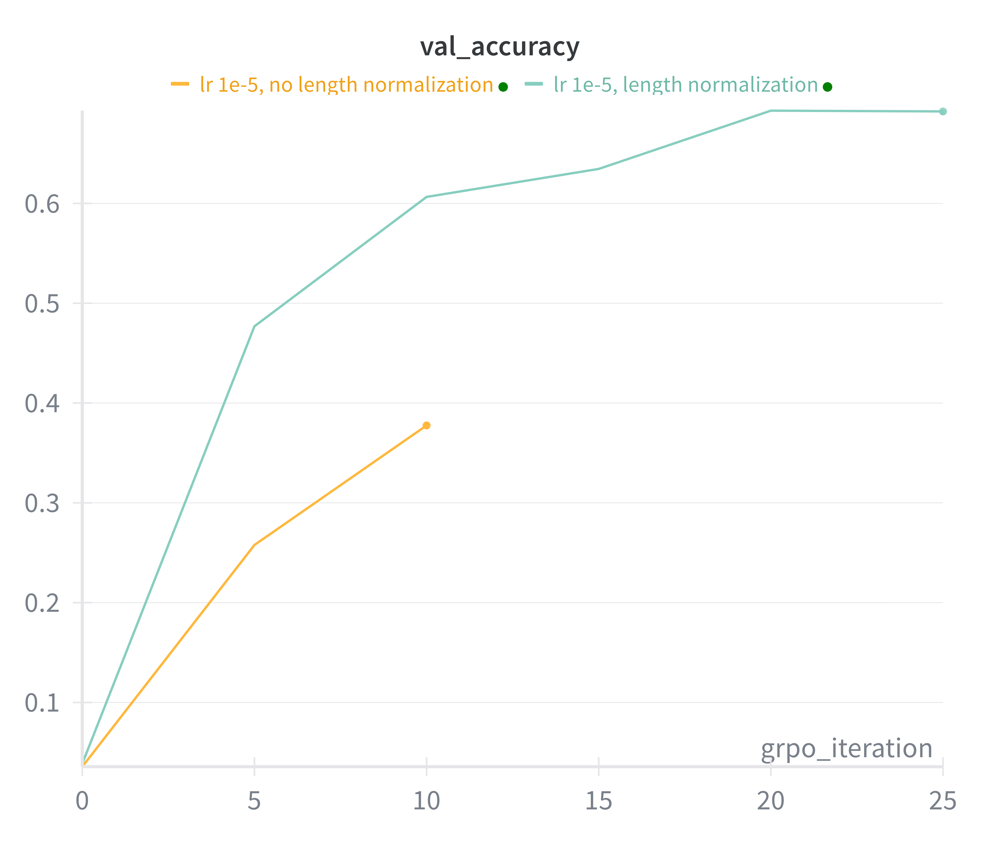

# Problem (grpo_length_normalization): Effect of length normalization (2 points) (2 H100
hrs)

Deliverable: Compare normalization with masked_mean and masked_normalize with an end-to-
end GRPO training run. Report the validation answer reward curves. Comment on the findings,
including any other metrics that have a noticeable trend.
Hint: consider metrics related to stability, such as the gradient norm.

```bash
uv run grpo_train_loop.py --no_length_normalization --lr 1e-5 --num_grpo_iterations 40
```



