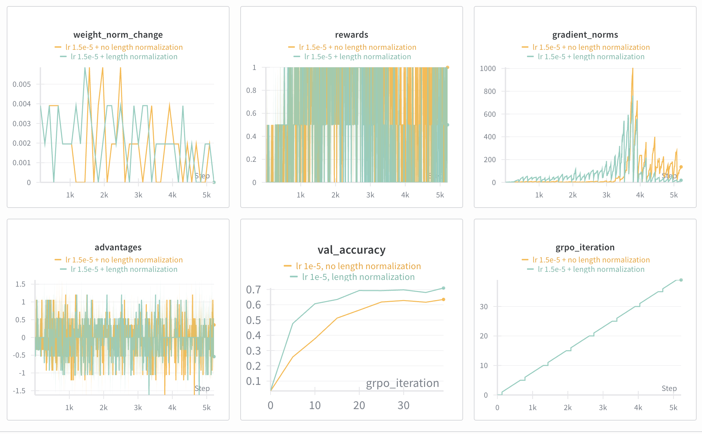
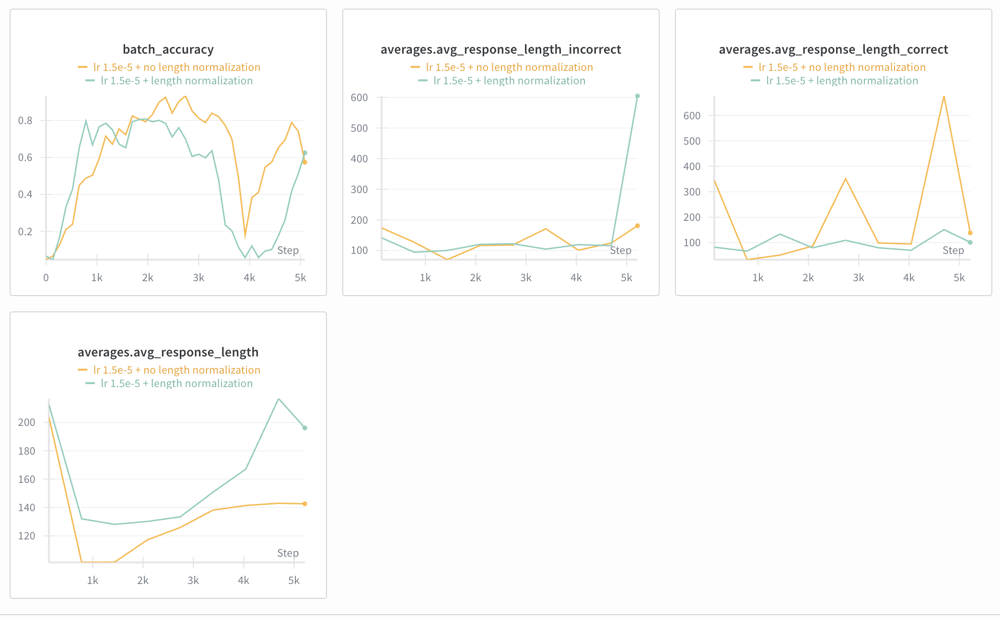

# Problem (grpo_length_normalization): Effect of length normalization (2 points) (2 H100
hrs)

Deliverable: Compare normalization with masked_mean and masked_normalize with an end-to-
end GRPO training run. Report the validation answer reward curves. Comment on the findings,
including any other metrics that have a noticeable trend.
Hint: consider metrics related to stability, such as the gradient norm.

```bash
uv run grpo_train_loop.py --no_length_normalization --lr 1e-5 --num_grpo_iterations 40
```





Look at this file where we puzzle out what should happen [here](./think_about_length_normalization.md). 

Now let's compare two loss weightings. We have response $i$, token $t$ and per-token loss: $L_{i,t}$. For each example, we can do two things 
1. Length normalization: average over resp length $T_i$: 

$$\sum_{t} L_{i,t}/T_i$$ 

2. No length normalization: average over max token length 

$$\sum_{t} L_{i,t}/M$$

The first penalizes every response the same, regardless of length. The second more heavily penalizes length, so we expect shorter responses. Take a look at the average response length in the plots above.
