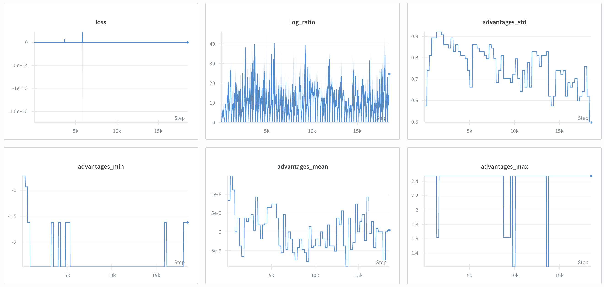
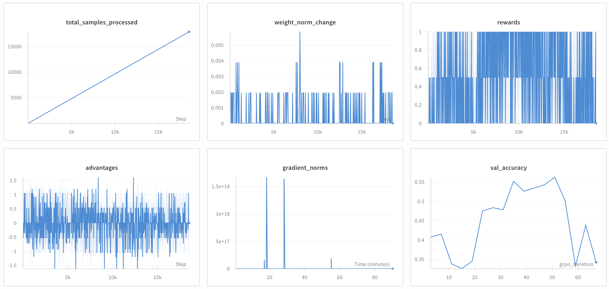
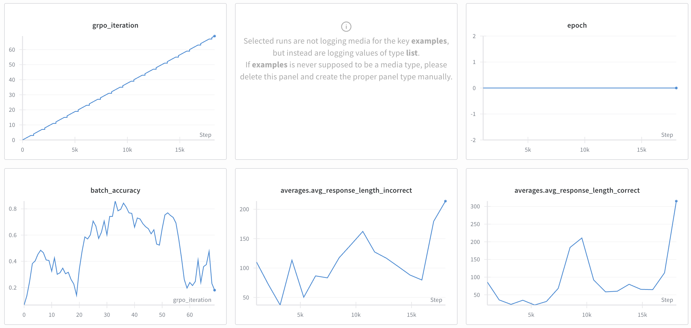
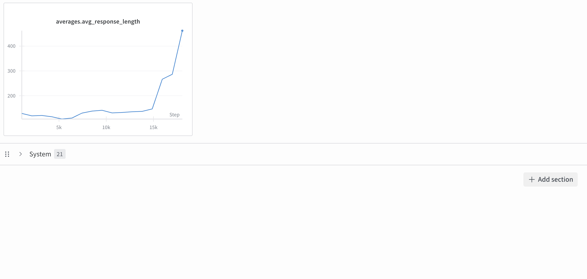

# Problem (grpo_off_policy_clip_ablation): Off-policy GRPO-Clip ablation (2 points) (2
H100 hrs)

Deliverable: Implement the unclipped per-token loss as a new loss type "GRPO-No-Clip". Take
your best performing off-policy hyperparameters from the previous problem and run the unclipped
version of the loss. Report the validation answer reward curves. Comment on the findings compared
to your GRPO-Clip run, including any other metrics that have a noticeable trend such as entropy,
response length, and gradient norm

----

Ran with lr = .5e-5, batchsize = 32, epochs = 1, grpo_no_clip loss. Below 
- Validation (and batch accuracy) goes up and then and then back up. Perhaps if I ran it for 200 iterations I would get good performance. I do not have the time. 
- You can see loss explodes negative in some iterations.
- Reponse length starts to baloon at the end
- log importance ratios blow up to about 40, meaning the importance ratio is $exp(\pm 40)$.

