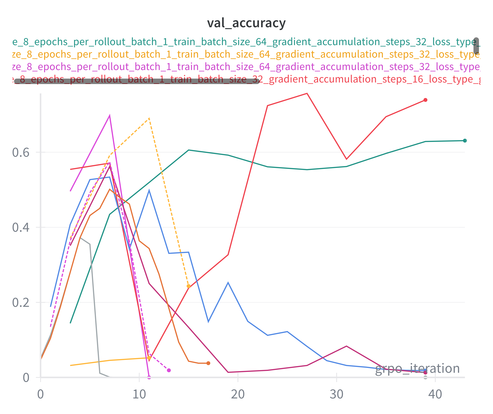
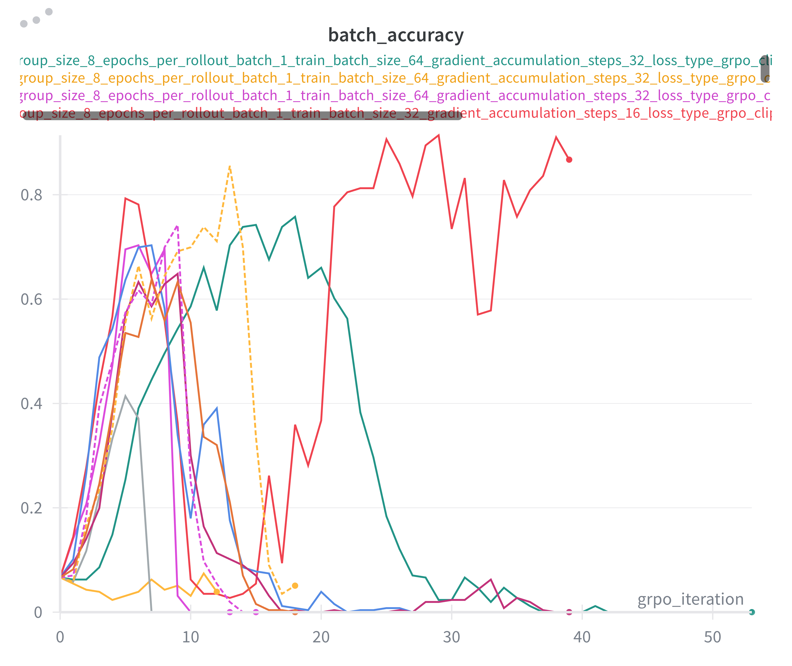
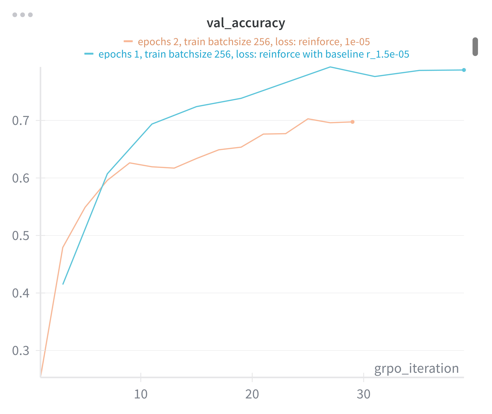

# Problem (grpo_off_policy_sweep): Off-policy GRPO hyperparameter sweep (4 points)
(12 H100 hrs)

Deliverable: Fixing rollout_batch_size = 256, choose a range over epochs_per_rollout_ ⌋
batch and train_batch_size to sweep over. First do a broad sweep for a limited number of GRPO
steps (<50) to get a sense of the performance landscape, and then a more focused sweep for a larger
number of GRPO steps (200). Provide a brief experiment log explaining the ranges you chose.
Compare to your on-policy run with epochs_per_rollout_batch = 1 and train_batch_size =
256, reporting plots with respect to number of validation steps as well as with respect to wall-clock
time.
Report the validation answer reward curves. Comment on the findings, including any other metrics
that have a noticeable trend such as entropy and response length. Compare the entropy of the model’s
responses over training to what you observed in the EI experiment.
Hint: you will need to change gradient_accumulation_steps to keep memory usage constant.

---- 

My conclusion after trying to debug my code (never found any serious issues): 

**GRPO with clip loss:**
- Increases the val acc at a similar rate to the on policy run. 
- However, the batch accuracy eventually drops to 0. When the batch accuracy drops to zero, two things can happen:
    1. We see no more rewards in the rollouts, so training stalls. 
    2. While it's dropping in accuracy, it takes val down with it. 
- Case 1 occured when the stepsize was .5e-6. Case 2 occured when the stepsize was between .75e-5 and 1.5e-5.
- The red curve in the plot below is the one anomolgy. Where the stepsize was 1.5e-5, batchsize 32, epochs = 1. The val acc died, but then rose again eventually.
- When the stepsize was 1e-6, val accuracy never increased from ~0.
- The above was happened whether we were using 1, 2, or 4 epochs and various trainin batch sizes. 

**A happy mistakes:**
- I found that when using reinforce with baseline (i.e., multiple epochs without clip loss or importance sampling), the training curves were mostly fine.

