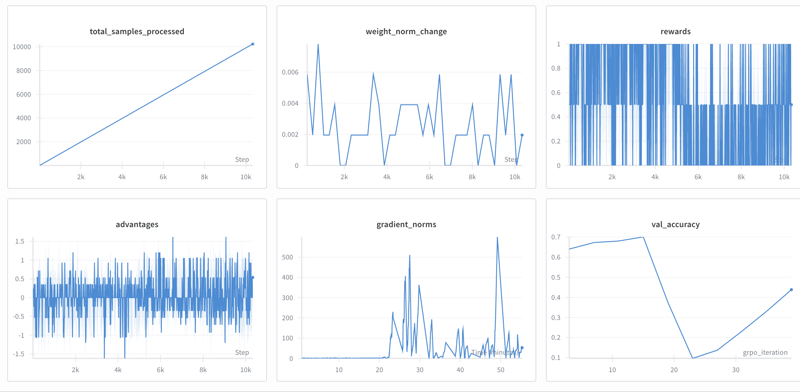
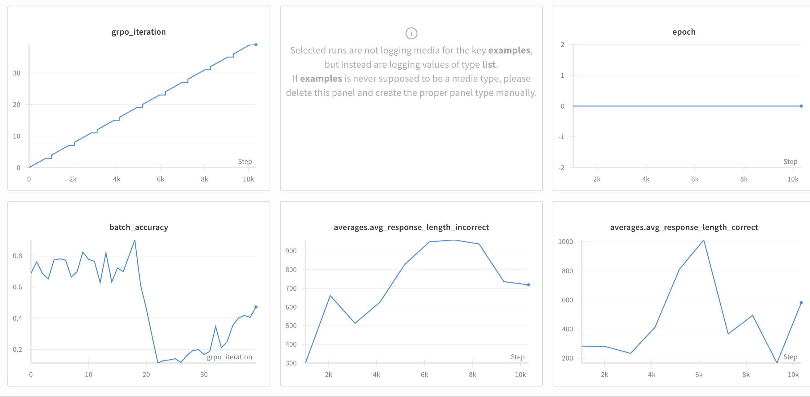
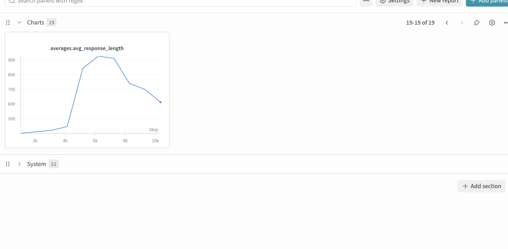

# Problem (grpo_prompt_ablation): Prompt ablation (2 points) (2 H100 hrs)

Deliverable: Report the validation answer reward curves for both the R1-Zero prompt and the
question-only prompt. How do metrics compare, including any other metrics that have a noticeable
trend such as entropy, response length, and gradient norm? Try to explain your findings.

**Conclusion:** 
- Accuracy went up really fast to 70% -- then crashed!
- The generations (in the [training log](./grpo_prompt_ablation_log.txt)) started to devolve. 
    - They had numerous chinese characters. 
    - They the started to contain a lot of special characters. 
    - The responses became very long.
- It seems that enforcing the format of the answer gives you lower initial reward (since you need the format). But later on your model collapses less. 

Training log is here: [grpo_prompt_ablation_log.txt](./grpo_prompt_ablation_log.txt)

