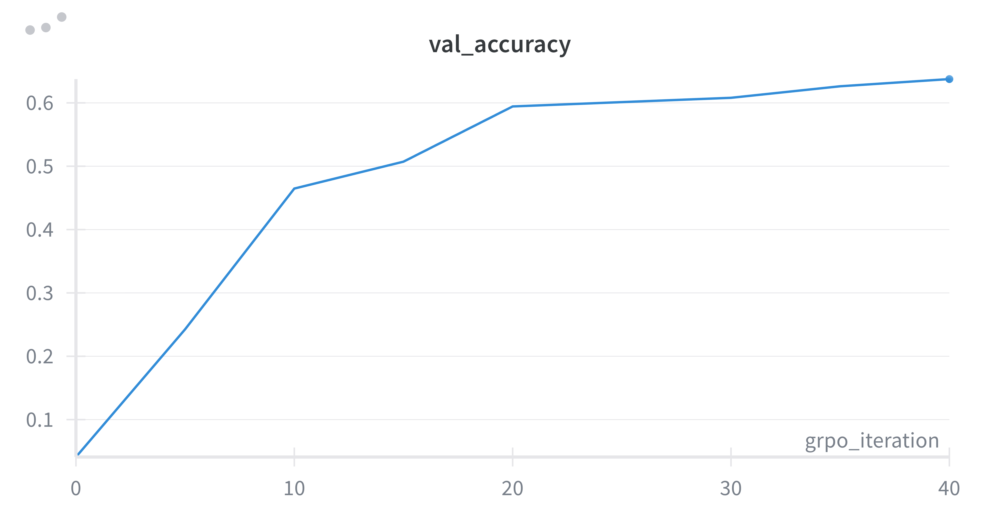

# Problem (grpo_train_loop): GRPO train loop (5 points)

Deliverable: Implement a complete train loop for GRPO. Begin training a policy on MATH and
confirm that you see validation rewards improving, along with sensible rollouts over time. Provide a
plot with the validation rewards with respect to steps, and a few example rollouts over time.       

```bash
uv run grpo_train_loop.py
```



You can see the rollouts in the [log file](./grpo_train_loop_log.txt)


