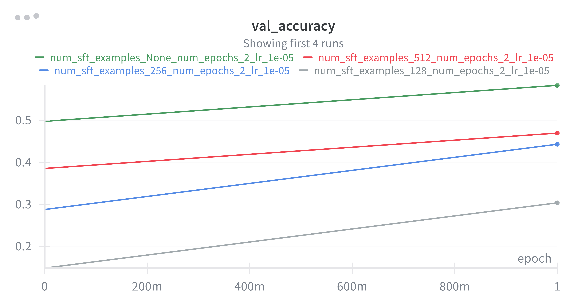

# Problem (sft_experiment): Run SFT on the MATH dataset (2 points) (2 H100 hrs)

## Question 1

Run SFT on the reasoning SFT examples (provided in /data/a5-alignment/MATH/sft.jsonl)
using the Qwen 2.5 Math 1.5B base model, varying the number of unique examples for SFT in the range {128, 256, 512, 1024}, along with using the full dataset. Tune the learning rate and
batch size to achieve at least 15% validation accuracy when using the full dataset.
Deliverable: Validation accuracy curves associated with different dataset sizes.

```bash
uv run sft_experiment.py --num_sft_examples ?? --batch_size 10 
```




## Question 2

Filter the reasoning SFT examples to only include examples that produce the correct answer. Run
SFT on the (full) filtered dataset and report the size of the filtered dataset and the validation
accuracy you achieve.

First filtered the dataset
```bash
uv run filter_gsm8k_positives.py
```


Deliverable: Report the size of the dataset and the validation accuracy curve you achieve.
Compare your findings to the previous SFT experiment.